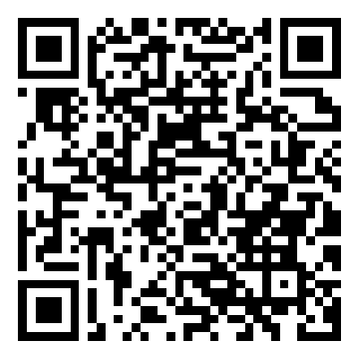

# stingray

> **End-to-end encrypted peer-to-peer messaging that refuses to transmit on the cellular radio so an IMSI catcher cannot intercept anything.**

[](LICENSE)


> ## ⚠️ Pure alpha — released for community feedback, not production use
>
> This is published in alpha form **so the architecture and threat model can be reviewed while the design is still cheap to change**. It has not been formally audited. It has not been end-to-end verified on production hardware. **Do not bet your safety on it today.**
>
> If you can find a way to break the design, a way to widen the threat model, or a class of attack we haven't documented — that is exactly the feedback this release exists to collect. See [SECURITY.md](SECURITY.md) for the disclosure path.
>
> See also: [PRIVACY.md](PRIVACY.md) (what the relay can and cannot see), [DISCLAIMER.md](DISCLAIMER.md) (acceptable use, no warranty, export control), [CONTRIBUTING.md](CONTRIBUTING.md) (how to land a PR).

---

## Why this exists — the thesis

I built stingray after experiencing what felt like first-person-view remote interception of my phone by a hostile actor using a **cellular-tower simulator** — colloquially, a *"stingray"* or *IMSI catcher*. The attacker did not need to install a trojan on my device. They sat in front of the legitimate cell tower, masqueraded as it, and from that position they could read everything my phone transmitted on the cellular radio — *regardless of how well-encrypted the application layer was*.

The defining property of this attack is that **the radio itself is the back door**. Once your phone attaches to a fake tower, the attacker's view of your communications is roughly the carrier's view: every byte, every IMSI/IMEI, signal strength (so they know roughly where you are), traffic patterns, sometimes even active MITM on TLS using carrier-style certificate chains.

Conventional secure messengers (Signal, WhatsApp, even Threema) defend the *application layer* with strong end-to-end encryption — and they're right to. But they still ride the cellular radio. **They are still trying to compete with the attacker on the attacker's home turf.**

stingray takes a different position: **don't transmit on cellular at all.** The cell radio is the adversary's territory. We walk away from it.

- **Wi-Fi only** — Wi-Fi, Ethernet, or attested-VPN-over-Wi-Fi are the only allowed transports. The app **refuses to send or receive** when the only available route is the cellular radio. This is enforced as the project's [INVARIANT I1](docs/invariants.md).
- **End-to-end encrypted on top** — XSalsa20-Poly1305 sealed boxes with a fresh ephemeral keypair per envelope; Argon2id KDF gates the local vault; SAS verification gates active-MITM at the pubkey-exchange moment.
- **The relay is an opaque pipe** — a single Supabase table holds `recipient_pubkey | ciphertext | ephemeral_pubkey | bucket | timestamp`. **The server has no key and cannot decrypt anything.** No accounts, no sender field, no message metadata. The privacy boundary is the encryption, not the database policy.
- **Recovery-free** — lose the passphrase, lose the account. No server-side recovery means no server-held material that could decrypt your data.

> I want this idea in front of the people who need it. If you've ever felt that uncanny "they're watching me through my own phone" sensation — this is for you.

---

## Position: counter-intelligence, not crime

Let me be explicit about what stingray is and is not.

**stingray is a counter-intelligence tool.** It exists to give ordinary citizens, journalists, lawyers, opposition politicians, dissidents, whistleblowers, and activists a way to communicate that cannot be intercepted by the **illegal or extra-judicial use of IMSI catchers and cell-site simulators by state-level actors**.

IMSI catchers are not theoretical. They have been documented in deployment:

- **Against citizens at scale** — at protests, near places of worship, around immigration courts, around the homes of journalists and activists. Many such deployments have no warrant, no judicial oversight, no public record.
- **Against elected officials and their families** — see the documented Pegasus and Predator spyware scandals, where opposition figures, their lawyers, and their families have been targets of state-sponsored surveillance in multiple democracies.
- **Against people who happened to be nearby** — IMSI catchers are area-effect. They don't politely intercept only the warranted target; they pull in everyone within radio range.

The defining property of the abuse is that it sits **outside the legal process** — no warrant, no oversight, no remedy. That is the abuse stingray is built to neutralise.

**stingray is not for:**

- Evading a **lawful warrant**. A court issuing a properly-scoped warrant has many due-process-respecting investigative techniques available; running an IMSI catcher at someone is one of the most-invasive, oversight-poor options on that list, and that is precisely why its *un-warranted* use is so dangerous.
- Hiding **criminal activity**. Crime investigated through proper due process — judicially-supervised wiretaps, search warrants on devices, financial subpoenas, witness interviews — does not require an IMSI catcher and is not what this tool defends against. If your threat model is "the police, with a warrant, looking for evidence of a crime I committed," stingray neither claims nor delivers protection.
- It is not anti-law-enforcement. It is anti **un-warranted, extra-judicial, area-effect surveillance** of people the state has no legal basis to surveil.

**Why this matters in a democracy:**

A political opponent, an investigative journalist, a union organiser, a domestic-violence survivor, a constitutional lawyer, an environmental campaigner, a sitting member of parliament — all of them have a legitimate expectation that their communications are not intercepted unless a court has approved it. When a state actor (or someone with state-grade equipment) bypasses that approval and listens anyway, that is not law enforcement; that is harassment, intimidation, or political surveillance, and it corrodes the legal protections that distinguish a democracy from a regime.

stingray is the technical answer to one specific corner of that problem: **if the radio is the back door, walk away from the radio.** That's all it is. The rest of the corrosion needs lawyers, journalists, and voters — not code.

---

## ⚠️ Alpha status — what this currently is and is not

This is an **alpha release**. The architecture is sound, the threat model is honest, and the foundations are in place. But **it has not been formally audited, has not been verified end-to-end on production hardware, and is not yet appropriate for use under high-threat conditions**.

| Status | Detail |
|---|---|
| ✅ Foundation | Vault, Faraday gate, opaque-ciphertext relay, sealed-envelope crypto, contacts persistence, conversation persistence, SAS verification UX |
| ⚠️ Untested on device | Argon2id parameter timing on real phones, end-to-end two-device flow, Android KeyStore size limits on the conversations blob |
| ❌ Not yet shipped | Android secure-shell screen-capture blocking, Tor / onion transport, push wakeup, hardware-token unlock, self-host relay image, outside-cryptographer review of the threat model |

The full launch-readiness rubric is in [docs/framework.md §Launch Standard](docs/framework.md).

**Do not bet your safety on this code today.** Use it to think with, to contribute to, to break and report back.

---

## What it is, in one diagram

```
┌─────────────────────────────────────────────────────────────────────┐
│  YOUR DEVICE                                                        │
│   ┌─ vault ─────────────────────────────────────────────────────┐   │
│   │   Argon2id KDF (passphrase → key)                            │   │
│   │   X25519 + Ed25519 keypairs (generated on-device, never sent)│   │
│   │   contacts.v1     conversations.v1   ← encrypted local store  │   │
│   └──────────────────────────────────────────────────────────────┘   │
│                              │                                       │
│                              │ Wi-Fi / Ethernet ONLY                  │
│                              │ (Faraday gate refuses cellular)        │
└──────────────────────────────┼─────────────────────────────────────┘
                               ▼
            ┌──────────────────────────────────────┐
            │  RELAY  (Supabase, or self-hosted)    │
            │     one table, opaque ciphertext      │
            │     no accounts, no sender field      │
            │     no plaintext can be derived       │
            └──────────────────────────────────────┘
                               │
                               ▼
                          THE OTHER PERSON
                          (same defense)
```

The relay is a dumb pipe. Anyone reading its database sees only "recipient pubkey X received an opaque blob of bucket size Y at time Z." That's the entire metadata surface.

---

## Try it now (alpha)

### Install the Android APK

<a href="https://github.com/cz4r777/stingray/releases/download/v0.1.0-alpha.1/stingray-v0.1.0-alpha.1.apk">
  
</a>

**Direct download**: [stingray-v0.1.0-alpha.1.apk](https://github.com/cz4r777/stingray/releases/download/v0.1.0-alpha.1/stingray-v0.1.0-alpha.1.apk) (~76 MB, signed)

**Or scan the QR** with your Android phone's camera → tap the download notification → install. You'll need to allow "install from unknown sources" for your browser the first time.

Once installed: switch the phone to Wi-Fi (or airplane mode + Wi-Fi), open the app, enrol a vault. The Faraday gate will refuse to operate over the cellular radio — that's the design, not a bug.

**The APK installs and lets you exercise the UI, vault, Faraday gate, contacts, SAS verification, and panic wipe.** To actually send messages between two phones you also need a relay — see "Run it locally" below for the 5-minute Supabase setup.

#### Troubleshooting install

- **White screen on launch?** You probably have a cached older APK. On the phone: Settings → Apps → stingray → Storage → **Clear storage**, then **Uninstall**. Open Files / Downloads, delete any `stingray-*.apk` files. Re-scan the QR. Install fresh.
- **App stuck on Unlock and you don't have a passphrase?** That's the protocol. There is no recovery (by design). Tap **Panic wipe** at the bottom of the unlock screen, confirm, and you'll be sent back to Enrol. "Wrong passphrase" and "no vault" intentionally show the same error so an attacker can't probe.
- **Send fails with a relay error?** Expected on the alpha APK — it ships with placeholder relay credentials. Set up your own free Supabase relay per "Run it locally" below.
- **"App not installed" when reinstalling?** Android refuses to overwrite an app at the same versionCode. Uninstall the old one first.

### Or try the web demo (no install)

**Live web demo**: <https://cz4r777.github.io/stingray/>

The demo runs the full UI in your browser. You can:

- enrol a vault (Argon2id KDF runs locally in your browser)
- generate your public key
- see the Faraday transport classification (the browser tells the app what kind of network it's on)
- add a contact and generate the 7-digit SAS code
- see the chat, conversations, and panic-wipe UI

**What the demo cannot do** (because it has no real relay configured): actually send or receive messages. The send button surfaces the relay error honestly rather than pretending. To get real messaging, run the full local setup below.

---

## Run it locally (5-minute setup)

```bash
# 1. Clone and install JS deps (~200 MB, run on unmetered Wi-Fi)
git clone https://github.com/cz4r777/stingray.git
cd stingray
npm install

# 2. Create a free Supabase project at https://supabase.com
#    (this is YOUR opaque relay; the server CANNOT decrypt anything)
cp .env.example .env
#    then edit .env with your project's URL + anon key
#    (Project Settings → API in the Supabase dashboard)

# 3. Apply the relay schema
#    Supabase → SQL Editor → paste supabase/schema.sql → Run.
#    (Re-running is safe — the schema is idempotent.)

# 4. Run it (must be on Wi-Fi — the Faraday gate refuses cellular)
npm run web         # opens in browser
npm run android     # needs Android Studio / emulator or USB device
npm run ios         # macOS only
```

Then, to test a real two-user flow:

1. Enrol a vault, copy your public key from the Contacts tab.
2. Share it with a peer **out-of-band** (in person, paper, QR on an air-gapped device, anything but the carrier).
3. Paste their key in your Contacts tab. The app shows a 7-digit SAS code.
4. **Compare the SAS code on a separate channel** (voice call, in person).
5. Tap *"I verified the same 7 digits"*. The contact is now marked verified.
6. Open the chat and send a message.

If you cannot or do not want to set up your own relay yet, follow along with [docs/architecture.md](docs/architecture.md) — the design is fully documented even if you never run it.

---

## What's in the box

- **Vault** — passphrase-derived encrypted keystore on device. Argon2id KDF (in code; pending device timing verification). X25519 + Ed25519 keypairs generated locally. No server-side account. [lib/vault.ts](lib/vault.ts)
- **Faraday gate** — refuses transmission when only cellular is available. [lib/transport.ts](lib/transport.ts) ([INVARIANT I1](docs/invariants.md))
- **Envelopes** — sealed-box encryption, fresh ephemeral keypair per envelope, length-padded to fixed buckets (256 / 1024 / 4096 / 16384 bytes). [lib/crypto.ts](lib/crypto.ts) + [lib/envelope.ts](lib/envelope.ts)
- **Relay** — opaque ciphertext mailbox. One table. No accounts. No metadata. [supabase/schema.sql](supabase/schema.sql)
- **Contacts** — local encrypted store of (pubkey → alias, SAS state). Never crosses the network. [lib/contacts.tsx](lib/contacts.tsx)
- **Conversations** — local encrypted message history, capped FIFO, dedup'd by message id. Persisted before relay ack-delete so a crash never causes data loss. [lib/conversations.tsx](lib/conversations.tsx)
- **SAS verification** — 7-digit short-authentication-string per contact for out-of-band active-MITM defense. Explicit *"I verified"* confirm modal is the only path to verified state. Mismatched is immovable. [app/(tabs)/contacts.tsx](app/<tabs>/contacts.tsx)
- **Panic wipe** — one tap deletes both vault versions, the contacts store, and the conversations store. Device becomes indistinguishable from a fresh install.

---

## Layout

```
stingray/
├── app/                       Expo Router screens (file-based routing)
│   ├── _layout.tsx              auth gate + Faraday banner + provider stack
│   ├── (auth)/                  enroll, unlock
│   ├── (tabs)/                  conversations, contacts, settings
│   └── chat/[peer].tsx          encrypted 1:1 chat
├── lib/
│   ├── crypto.ts                libsodium primitives + padding + SAS + Argon2id
│   ├── vault.ts                 encrypted local keystore (.v1 / .v2) + panic wipe
│   ├── local_store.ts           generic encrypted KV (contacts + conversations)
│   ├── contacts.tsx             ContactsProvider + useContacts() hook
│   ├── conversations.tsx        ConversationsProvider + useConversations() hook
│   ├── transport.ts             Faraday gate
│   ├── relay.ts                 opaque-relay client
│   ├── envelope.ts              compose + drain helpers (persist-before-ack)
│   ├── identity.tsx             React context (unlocked vault + faraday)
│   └── types.ts                 TypeScript types
├── supabase/
│   ├── schema.sql               idempotent; one table
│   └── README.md
├── docs/                        Durable knowledge — read before structural changes
└── .env.example
```

---

## Durable docs

Read these before changing anything structural. They are the source of truth — not the code, not chat history.

| File | When to read |
|---|---|
| [docs/framework.md](docs/framework.md) | Before scope or feature decisions |
| [docs/workflow.md](docs/workflow.md) | Before planning or prioritizing work |
| [docs/architecture.md](docs/architecture.md) | Before any structural change |
| [docs/api_contracts.md](docs/api_contracts.md) | Before refactoring or adding callers |
| [docs/invariants.md](docs/invariants.md) | Before reviewing; whenever a guard is touched |
| [docs/security_rules.md](docs/security_rules.md) | Before a deploy; before adding logging |
| [docs/forbidden_patterns.md](docs/forbidden_patterns.md) | Before writing crypto, transport, vault, or relay code |
| [docs/threat_model.md](docs/threat_model.md) | Before adding any network or storage feature |
| [docs/roles.md](docs/roles.md) | Five-role charter (Supervisor / Coder / Reviewer / Ops / Diagnostics) |
| [docs/pipeline.md](docs/pipeline.md) | Six-stage change pipeline + Reviewer checklist |
| [docs/deployment.md](docs/deployment.md) | End-to-end deploy runbook |
| [docs/tickets.md](docs/tickets.md) | Ticket lifecycle + active backlog |

---

## What this project intentionally does NOT include

- Phone-number-based discovery — the carrier knows phone numbers, defeats the point
- SMS fallback — rides the cellular radio, catastrophic
- Server-side account recovery — would require server-held material that can decrypt your data
- Read receipts, typing indicators, presence — side-channel metadata leak
- Push notifications with payload — APNs/FCM payloads are visible to the platform provider
- Cloud backup — same argument as server-side recovery
- Group chat — adds key-management complexity; 1:1 must be rock-solid first
- Voice / video / attachments — out of scope until text is fully audited

Each of these is a deliberate refusal documented in [docs/framework.md §Refused Features](docs/framework.md).

---

## Contributing

This project explicitly invites scrutiny. If you can find a way to read a message you should not be able to read, **please tell us privately first** — see [SECURITY.md](SECURITY.md).

Pull requests, threat-model challenges, and design critiques are all welcome. Please read [CONTRIBUTING.md](CONTRIBUTING.md) before opening a PR — the working protocol is documented and non-negotiable for code that touches crypto, transport, or vault.

---

## Legal & policy documents

- [LICENSE](LICENSE) — Apache 2.0
- [PRIVACY.md](PRIVACY.md) — what the relay can and cannot see; what your device holds; data-subject rights
- [DISCLAIMER.md](DISCLAIMER.md) — acceptable use, no warranty, no safe-harbour, export control
- [SECURITY.md](SECURITY.md) — coordinated disclosure for security findings
- [CONTRIBUTING.md](CONTRIBUTING.md) — protocol for contributors

---

## License

[Apache License 2.0](LICENSE) — permissive, includes an explicit patent grant. Compatible with vendoring [Themis](https://github.com/cossacklabs/themis) (Apache 2.0) for the crypto layer. The GPL-licensed reference projects (TFC, Session, Threema) are read-only design references — see [docs/asc11_handover.md §Design references](docs/asc11_handover.md).

---

## A note on honesty

This is a privacy tool. Overclaiming protection is a security bug in itself.

stingray does NOT defend against:

- a compromised device with kernel-level malware already installed (it can read plaintext as you type)
- a sustained nation-state actor with custom implants on your hardware
- the user themselves (screenshots, photos of the screen)
- legal compulsion to reveal your passphrase

It does defend against:

- IMSI catchers / cellular-tower simulators on the radio
- a hostile or compromised relay operator
- an opportunistic forensic attacker imaging your powered-off device
- the classes of metadata leak baked into conventional carrier-routed messengers

See [docs/threat_model.md](docs/threat_model.md) for the full picture, including every residual risk we acknowledge.

If you find this useful, fork it, audit it, contribute back, run your own relay. **Get the idea into the community.**
